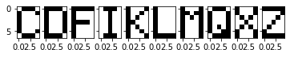

## SingleLayerPerceptron with sklearn

SingleLayerPerceptron for letter classification

# The first thing we need to do is upload the file with our letters.data

```python
  from google.colab import files
  uploaded = files.upload()

  import io
  df = pd.read_csv(io.BytesIO(uploaded['letters.data']),header=None)
  my_letters = [2,3,5,8,10,11,12,16,23,25]
  X = df.iloc[my_letters,:35].values
```

