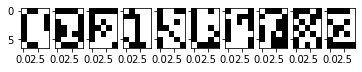
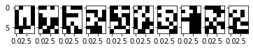

## SingleLayerPerceptron with sklearn

SingleLayerPerceptron for letter classification

# The first thing we need to do is upload the file with our letters.data, and pick 10 letters we want

```python
  from google.colab import files
  uploaded = files.upload()

  import io
  df = pd.read_csv(io.BytesIO(uploaded['letters.data']),header=None)
  my_letters = [2,3,5,8,10,11,12,16,23,25]
  X = df.iloc[my_letters,:35].values
```


# We then create an object of class SLP and match it

```python
  net = SLP()
  net.fit(X,y)
  net.predict(X)
```
# We define a damge function that corrupts a percentage of our letters

```python
  def damage(X,percent,seed=1):
    rgen = np.random.RandomState(seed)
    result = np.array(X)
    count = int(X.shape[1]*percent/100)
    for indeks_example in range(len(X)):
        order = np.sort( rgen.choice(X.shape[1], count, replace = False))
        for indeks_pixel in order:
            result[indeks_example][indeks_pixel]*=-1
    return result
```

# We then repeat the classifications on letters that are damaged to varying degrees, and write out the number of misclassifications

```python
  X_5 = damage(X,5)
  X_15 = damage(X,15)
  X_40 = damage(X,40)
```
# 5 % damaged letters

```python
  net.show(X_5)
  net.predict(X_5)
  net.misclassified(X_5,y)
```
Misclassified           |  Damaged letters
:-------------------------:|:-------------------------:
1  |  


# 15 % damaged letters

```python
  net.show(X_15)
  net.predict(X_15)
  net.misclassified(X_15,y)
```
Misclassified           |  Damaged letters
:-------------------------:|:-------------------------:
4  |  

# 40 % damaged letters

```python
  net.show(X_40)
  net.predict(X_40)
  net.misclassified(X_40,y)
```
Misclassified           |  Damaged letters
:-------------------------:|:-------------------------:
40  |  

# If you would like to classify more letters then you need to increase the response matrix **y**. 
